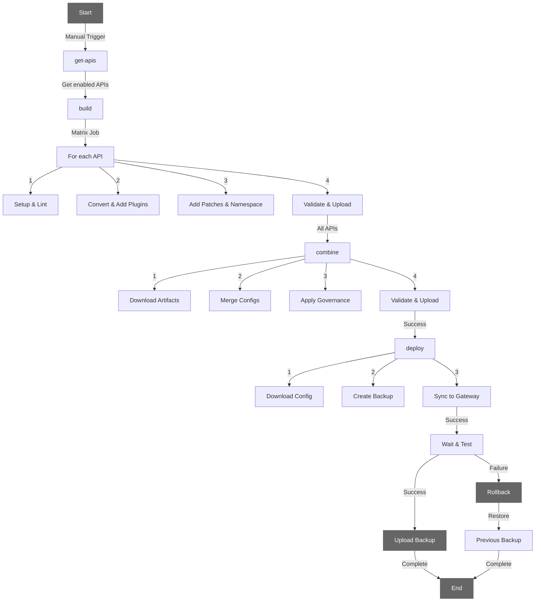

# MT-APIOps Example

This repository contains an example of API Operations (APIOps) implementation using Kong Gateway and related tools. It demonstrates best practices for API management, documentation, and automation.

## Project Structure

```
.
├── apis/                          # API definitions and documentation
│   ├── flights/                   # Flight-related API endpoints
│   │   └── v1/                   # Version 1 of the Flights API
│   │       ├── openapi.yaml      # OpenAPI specification
│   │       └── kong/            # Kong-specific configurations
│   │           └── plugins/     # API-specific plugins
│   └── routes/                   # Route-related API endpoints
│       └── v1/                   # Version 1 of the Routes API
│           ├── openapi.yaml      # OpenAPI specification
│           └── kong/            # Kong-specific configurations
│               └── plugins/     # API-specific plugins
├── entities/                     # Entity definitions
│   └── tripwhiz/                # TripWhiz entity configuration
│       ├── metadata.json        # Entity metadata
│       ├── kong/               # Entity-specific Kong configurations
│       │   ├── plugins/       # Entity-level plugins
│       │   └── patches/       # Entity-level patches
│       └── env.*.sh           # Environment-specific configurations
├── governance/                    # Governance configuration
│   ├── kong/                   # Kong Gateway configuration
│   │   └── patches/           # Governance patches
│   ├── kong.ruleset.yaml      # Kong configuration specific rules
│   └── openapi.ruleset.yaml   # OpenAPI validation rules
├── .github/                    # GitHub Actions workflows
│   └── workflows/             # CI/CD workflow definitions
│       └── build-deploy.yaml  # Build and deploy workflow
└── .gitignore                 # Git ignore rules
```

## Configuration

The project uses the following configuration files:

- `platform/kong.ruleset.yaml`: Defines Kong-specific rules and policies
- `platform/openapi.ruleset.yaml`: Contains OpenAPI validation rules


## API Documentation

The project includes two main API categories:

- **Flights API**: Handles flight-related operations
- **Routes API**: Manages route-related operations

Each API is documented using OpenAPI specifications.

## CI/CD

The project uses GitHub Actions for continuous integration and deployment. The workflows are defined in the `.github/workflows` directory and include:

### Build and Deploy Workflow (`build-deploy.yaml`)
The build and deploy workflow handles the build and deployment of API configurations to Konnect Control Planes.

- **Trigger**: Manual workflow dispatch
- **Inputs**:
  - `entity`: The entity to build configuration for (e.g., tripwhiz)
  - `environment`: Target environment (development/acceptance/production)
  - `show-summary`: Optional boolean to show build and deploy summary (default: true)
- **Jobs**:
  1. `get-apis`: Retrieves enabled APIs from entity metadata for the specified environment
  2. `build`: Matrix job that for each API:
     - Sets up environment variables and Deck configuration
     - Lints OpenAPI specifications using governance rules
     - Converts OpenAPI specs to Kong declarative config
     - Adds API-specific plugins
     - Adds entity-level plugins and patches
     - Applies namespace configurations
     - Adds tags
     - Validates and renders Kong configurations
     - Uploads generated artifacts
  3. `combine`: Merges all API configurations:
     - Downloads all API artifacts
     - Merges configurations into a single file
     - Applies governance patches
     - Validates and lints combined configuration
     - Shows configuration preview and diff in summary (if enabled)
     - Uploads combined configuration
  4. `deploy`: Deploys the combined configuration:
     - Downloads combined configuration
     - Creates backup of current Kong Gateway configuration (with generated_by:apiops tag)
     - Syncs new configuration to Kong Gateway
     - Tests the API
     - Reverts to backup if sync or tests fail
     - Creates and uploads recent backup on success

### Environment Support
The workflows support multiple environments:
- Development (dev)
- Acceptance (acc)
- Production (prd)

### Security and Reliability
- Uses GitHub Secrets for sensitive information
- Implements environment-specific configurations
- Validates API specifications before deployment
- Creates tagged backups before deployment
- Implements automatic rollback on failure
- Uses governance rules for validation
- Supports configuration preview and diff review

### Build and Deploy Process Flow
